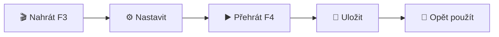

# 🎯 MiniTask - Automatizace maker pro Windows

**MiniTask** je výkonný open-source nástroj pro nahrávání a automatické přehrávání maker - moderní alternativa k TinyTask. Nahrajte své akce myši a klávesnice jednou a přehrajte je neomezeně s plnou kontrolou nad rychlostí a opakováním.


---

## ✨ Hlavní funkce

<table>
<tr>
<td width="50%">

### 🎮 Ovládání
- **🔴 Nahrávání** - Zachycuje pohyby myši, kliknutí a klávesy
- **▶️ Přehrávání** - Přesné opakování všech akcí
- **⏱️ Timing** - Zachovává přesné časování mezi akcemi
- **⏹️ Stop** - Okamžité zastavení ESC nebo F4

</td>
<td width="50%">

### ⚙️ Nastavení
- **⚡ Rychlost** - 0.1x až 5x (10x zpomalít - 5x zrychlit)
- **🔁 Opakování** - 1-1000x nebo nepřetržitý režim
- **💾 Ukládání** - JSON formát (.mtask soubory)
- **⌨️ Zkratky** - F3/F4/ESC globálně

</td>
</tr>
</table>

---

## 🚀 Rychlý start

### 💻 Spuštění z EXE (DOPORUČENO)

> **Stačí stáhnout a spustit - žádná instalace!**

1. **Stáhněte** `MiniTask.exe` z [Releases](../../releases)
2. **Spusťte** soubor (dvoj-klik)
3. **Hotovo!** 🎉 Můžete začít nahrávat makra

> ⚠️ **Windows SmartScreen:** První spuštění může zobrazit varování. Klikněte "Více informací" → "Přesto spustit"

### 🐍 Spuštění ze zdrojového kódu

```powershell
# 1. Naklonujte repozitář
git clone https://github.com/VASE_JMENO/MiniTask.git
cd MiniTask

# 2. Instalujte závislosti
pip install -r requirements.txt

# 3. Spusťte aplikaci
python minitask.py
```

---

## 🎮 Ovládání

### Klávesové zkratky

| Klávesa | Akce |
|---------|------|
| **F3** | Spustit/zastavit nahrávání |
| **F4** | Spustit/zastavit přehrávání |
| **ESC** | Zastavit vše |

### Pracovní postup

> **5 jednoduchých kroků k automatizaci:**



#### 1️⃣ Nahrání makra
- Stiskněte **F3** nebo tlačítko "⏺ Nahrávat"
- Proveďte akce, které chcete automatizovat
- Stiskněte **F3** znovu pro ukončení

#### 2️⃣ Nastavení přehrávání
- Upravte **rychlost** pomocí posuvníku (0.1x - 5x)
- Nastavte **počet opakování** (1-1000) nebo zaškrtněte **nepřetržité**

#### 3️⃣ Přehrání makra
- Stiskněte **F4** nebo tlačítko "▶ Přehrát"
- Pro zastavení použijte **F4** nebo **ESC**

#### 4️⃣ Uložení makra
- Klikněte na "💾 Uložit"
- Vyberte umístění a název souboru
- Makro se uloží jako `.mtask` soubor

#### 5️⃣ Načtení makra
- Klikněte na "📂 Načíst"
- Vyberte `.mtask` soubor
- Makro je připraveno k použití

---

## 📦 Vytvoření EXE

Pro vytvoření samostatného spustitelného souboru:

```powershell
# Instalace PyInstaller
pip install -r requirements.txt

# Build EXE
python build_exe.py

# Výsledek: dist\MiniTask.exe
```

Podrobné informace v [BUILD_INSTRUCTIONS.md](BUILD_INSTRUCTIONS.md)

---

## 📁 Formát souborů

Makra jsou ukládána v čitelném JSON formátu (`.mtask`):

```json
{
  "version": "1.0",
  "created": "2025-11-28T10:30:00",
  "actions": [
    {
      "type": "mouse_move",
      "x": 500,
      "y": 300,
      "time": 0.5
    },
    {
      "type": "mouse_click",
      "button": "Button.left",
      "pressed": true,
      "time": 1.0
    }
  ]
}
```

---

## ⚙️ Nastavení

### Rychlost přehrávání
- **0.1x** → Velmi pomalé (10× zpomalení)
- **1.0x** → Normální rychlost ⭐
- **5.0x** → Velmi rychlé (5× zrychlení)

### Režimy opakování
- **Jednorázové** → Přehraje makro 1× a zastaví
- **Vícenásobné (1-1000)** → Přehraje makro N× a zastaví
- **Nepřetržité** → Přehrává dokola, dokud nezastavíte (F4/ESC)

---

## 🔧 Požadavky

### Pro spuštění EXE
- ✅ Windows 7/8/10/11
- ✅ Žádné další požadavky!

### Pro spuštění ze zdrojového kódu
- Python 3.7+
- Knihovna `pynput` (instaluje se automaticky)
- Tkinter (většinou předinstalováno s Pythonem)

---

## 🐛 Řešení problémů

### ❌ Makro se nepřehrává správně
- Ujistěte se, že používáte stejné rozlišení obrazovky
- Makra zaznamenávají absolutní pozice myši
- Zkuste snížit rychlost přehrávání

### ❌ Nefunguje v některých aplikacích
- Spusťte MiniTask jako **správce** (pravý klik → Spustit jako správce)
- Některé zabezpečené aplikace (UAC dialogy) blokují automatizaci

### ❌ GUI se nezobrazuje
```powershell
# Test Tkinter instalace
python -m tkinter
```

### ❌ Chyba při importu pynput
```powershell
pip install --upgrade pynput
```

---

## 🔄 MiniTask vs. TinyTask

| Vlastnost | MiniTask | TinyTask |
|-----------|----------|----------|
| Nahrávání myši/klávesnice | ✅ | ✅ |
| Rychlost přehrávání | ✅ (0.1x-5x) | ✅ |
| Opakování | ✅ (1-1000 + nepřetržité) | ✅ |
| Ukládání/načítání | ✅ JSON (.mtask) | ✅ (.exe/.rec) |
| Klávesové zkratky | ✅ F3/F4/ESC | ✅ F9/F10 |
| **Open source** | ✅ | ❌ |
| **Multiplatformní** | ✅ Win/Mac/Linux | ❌ (jen Windows) |
| **Moderní GUI** | ✅ | Základní |
| **Čitelný formát** | ✅ JSON | ❌ Binární |
| **Velikost** | ~12-18 MB | ~40 KB |

---

## 🛡️ Bezpečnost a ochrana soukromí

- ✅ Program běží **lokálně** (žádné připojení k internetu)
- ✅ Makra jsou uložena **pouze na vašem počítači**
- ✅ **Open-source** - můžete zkontrolovat kód
- ⚠️ Vyžaduje oprávnění pro **zachycení/simulaci vstupů**
- ⚠️ Některé antivirové programy mohou hlásit **false positive**

---

## 📝 Poznámky

### ⚠️ Důležité
- Makra používají **absolutní souřadnice myši** → nejlepší výsledky na stejném rozlišení
- Některé aplikace **blokují automatizaci** ze bezpečnostních důvodů
- Před testováním maker **uložte rozdělanou práci** (pro jistotu)

### 💡 Tipy
- Pro spolehlivé výsledky používejte **stejné rozlišení obrazovky**
- Klávesové zkratky fungují **globálně** (i když není MiniTask v popředí)
- **ESC vždy zastaví** běžící makro okamžitě

---

## 📄 Licence

Tento projekt je poskytován **"jak je"** bez jakýchkoliv záruk. Používejte na vlastní riziko.

**MIT License** - můžete volně používat, upravovat a distribuovat.

---

## 👨‍💻 Autor

Vytvořeno jako **open-source alternativa** k TinyTask s rozšířenými funkcemi a moderním GUI.

---

## 🤝 Přispívání

Návrhy na vylepšení, hlášení chyb a pull requesty jsou vítány!

1. Fork projektu
2. Vytvořte feature branch (`git checkout -b feature/NoveFunkce`)
3. Commit změn (`git commit -m 'Přidána nová funkce'`)
4. Push do branch (`git push origin feature/NoveFunkce`)
5. Otevřete Pull Request

---

## ⚠️ Varování

Tento nástroj je určen pro **legitimní automatizaci opakujících se úkonů**.

**Nepoužívejte** pro:
- ❌ Podvádění ve hrách
- ❌ Obcházení bezpečnostních opatření
- ❌ Porušování pravidel aplikací/služeb
- ❌ Jakékoliv škodlivé účely

**Používejte zodpovědně!** ⚖️

---

## 🌟 Podpora projektu

Pokud se vám MiniTask líbí:
- ⭐ Dejte projektu hvězdičku na GitHubu
- 🐛 Nahlaste chyby a navrhněte vylepšení
- 📢 Sdílejte s ostatními

Děkujeme! 🙏
